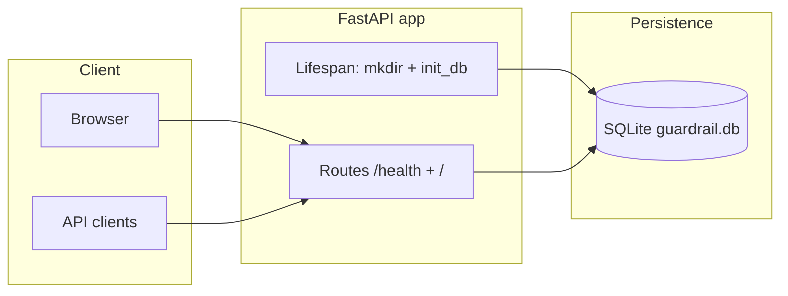

# Enterprise Security Guardrail Auditor

API-first security auditing platform for Terraform. **Phase 1** delivers the FastAPI shell, SQLite persistence layer, ORM models, health checks, and a minimal dark-themed landing page. Terraform scanning, the rule engine, dashboards, and Docker/CI ship in later phases.

## Requirements

- Python **3.12** (recommended). The project runs on **3.10+** when wheels are available for your platform.
- pip / venv

## Quick start

```bash
cd security-guardrail-auditor
python3.12 -m venv .venv   # or: python3 -m venv .venv
source .venv/bin/activate   # Windows: .venv\Scripts\activate
pip install -r requirements.txt
cp .env.example .env        # optional overrides
uvicorn app.main:app --reload --host 0.0.0.0 --port 8000
```

Open `http://127.0.0.1:8000/` for the UI stub, `http://127.0.0.1:8000/docs` for OpenAPI, and `http://127.0.0.1:8000/health` for JSON health.

## Phase 1 architecture



- **`app/core`**: environment-driven `Settings`, SQLAlchemy engine/session, `init_db()` metadata bootstrap.
- **`app/models`**: `scans`, `findings`, `uploaded_files`, `audit_logs` with relationships and cascade rules.
- **`app/api`**: versioned route modules (health in Phase 1).
- **`app/main.py`**: application factory, static mount, Jinja2 templates, lifespan hooks.
- **`data/`**, **`uploads/`**, **`reports/`**: local directories (gitignored artifacts, `.gitkeep` for structure).

## Tests

```bash
pytest
```

## Environment variables

See `.env.example`. `DATABASE_URL` defaults to `sqlite:///<project>/data/guardrail.db` when not set.

## Roadmap (from master plan)

| Phase | Scope |
|-------|--------|
| 2 | Terraform parser (`python-hcl2`) + security rule engine |
| 3 | Scan/findings/metrics REST APIs + persistence wiring |
| 4 | Dashboard (Tailwind + Chart.js) |
| 5 | Docker, GitHub Actions, expanded pytest coverage |
| 6 | Hardening, polish, documentation |

## License

Proprietary / educational use unless you attach an explicit OSS license.
