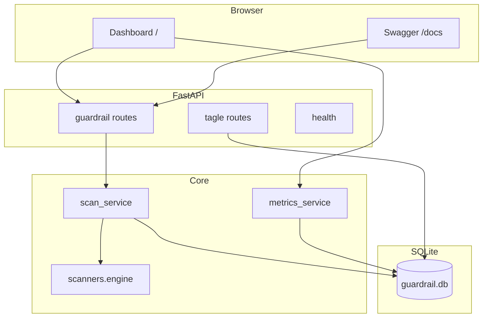

# Enterprise Security Guardrail Auditor

API-first Terraform security auditing platform: **FastAPI + SQLite + python-hcl2 rule engine**, REST APIs, **dark dashboard** (Tailwind + Chart.js), Docker, GitHub Actions CI, and pytest coverage.

## Requirements

- Python **3.12** (recommended) or **3.10+**
- pip / venv (or Docker)

## Quick start (local)

```bash
cd security-guardrail-auditor
python3 -m venv .venv
source .venv/bin/activate   # Windows: .venv\Scripts\activate
pip install -r requirements.txt
cp .env.example .env        # optional
uvicorn app.main:app --reload --host 127.0.0.1 --port 8000
```

Or: `bash scripts/dev.sh` (creates venv if missing, then runs Uvicorn).

Open **http://127.0.0.1:8000/** for the **dashboard**, **http://127.0.0.1:8000/docs** for Swagger, **http://127.0.0.1:8000/health** for liveness.

## Docker

```bash
docker compose up --build
```

App listens on **http://127.0.0.1:8000** (mapped from container). SQLite and uploads use named volumes (`docker-compose.yml`).

## REST API (MVP)

| Method | Path | Description |
|--------|------|-------------|
| GET | `/health` | Liveness |
| POST | `/scan` | Multipart upload: `files` (repeatable `.tf`), optional `name` |
| GET | `/scans` | Recent scans + finding counts |
| GET | `/findings` | Optional `scan_id`, `limit`, `offset` |
| GET | `/findings/{id}` | Single finding |
| GET | `/metrics` | Aggregates + severity distribution + risk trend |
| DELETE | `/scan/{id}` | Remove scan (cascades findings/files/audit rows) |
| GET | `/tagle/assessment` | Tagle-style demo JSON (bundled sample) |
| GET | `/tagle/about` | Tagle integration notes |

### Example: scan from CLI

```bash
curl -sS -X POST "http://127.0.0.1:8000/scan" \
  -F "name=demo" \
  -F "files=@tests/fixtures/terraform/insecure.tf"
```

## Rule engine (high level)

Rules cover, among others: **public S3 ACLs**, **S3 public access block disabled**, **open security groups (SSH/RDP/all)**, **public RDS**, **unencrypted RDS/EBS**, **public EC2**, **IAM wildcard policies** (string/jsonencode heuristics), **DynamoDB SSE off**, **broad NACL allows**, **missing CloudTrail resource**, **hardcoded secrets / AKIA patterns** in raw `.tf` text.

Each finding includes **remediation** and a **Terraform fix snippet** (AI-style recommendation template).

## Risk scoring

Weighted severities (**critical=10, high=7, medium=5, low=2**) roll into a **0–100 risk score** and **compliance %** stored on each completed scan (`summary_json` holds severity counts and weighted points).

## Architecture



## Tests & lint

```bash
pytest
ruff check app tests
```

## Tagle.ai (optional demo)

Bundled **Tagle-style** JSON and `/tagle/*` routes are documented under **Tagle.ai integration** in earlier commits; see `data/TAGLE_AI_TEST_RESULTS.md` and `GET /tagle/about`.

## Deliverables (portfolio)

See **docs/DELIVERABLES.md** for PPT outline, resume bullets, and interview talking points.

## CI

GitHub Actions workflow **`.github/workflows/ci.yml`** runs **ruff** + **pytest** on Python 3.11 and 3.12.

## License

Proprietary / educational use unless you attach an explicit OSS license.
